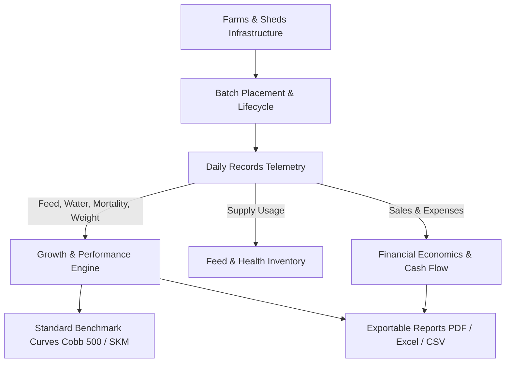

# FlockSense — Precision Commercial Poultry Management & Analytics

[](https://flutter.dev)
[](https://dart.dev)
[](https://firebase.google.com)
[](https://riverpod.dev)
[](#-testing--quality-assurance)
[](LICENSE)
[](https://github.com/Muthudeenathayalan)

**FlockSense** is an enterprise-grade mobile application and precision poultry telemetry platform engineered for modern commercial broiler and layer operations, breeding farms, and integrated agribusinesses. Built with **Flutter**, **Firebase Cloud Firestore**, and **Riverpod**, FlockSense empowers farm owners, flock supervisors, and integrators with real-time flock monitoring, automated standard FCR calculations, growth benchmarking curves, inventory auditing, medication schedules, and financial unit economics.

---

## 🚀 Core Capabilities



### 🏢 Multi-Farm & Shed Infrastructure
- **Hierarchical Farm Topology**: Manage multiple farm locations and individual sheds under a centralized command center.
- **Physical Capacity Intelligence**: Automated capacity calculation based on shed dimensions (length $\times$ width) and commercial broiler density standards ($1.2\text{ sq ft/bird}$).
- **Overstocking Prevention**: Built-in capacity validation guards against bird placements exceeding physical shed or farm capacity limits.
- **Aggregated Telemetry**: Real-time rollups of live bird population, active flock cycles, and total farm capacity.

### 🐣 Batch Lifecycle & Population Tracking
- **Placement to Harvest**: Complete tracking of flock cycles from Day 0 chick placement to final harvest and bird liquidation.
- **Non-Negative Population Dynamics**: Mathematical population continuity accounting for mortality, culls, and count adjustments:
  $$\text{Closing Population} = \max(0, \text{Opening} - \text{Mortality} - \text{Culls} + \text{Adjustments})$$
- **Shed Bird Allocations**: Support for allocating batches across multiple physical sheds with date tracking.
- **Placement Validation**: Restricts non-positive bird counts and dates placed in the far future.

### 📊 Precision Analytics & Benchmark Engine
- **Standard Commercial Broiler FCR**: Calculates Feed Conversion Ratio strictly against authoritative live biomass:
  $$\text{FCR} = \frac{\text{Total Feed Consumed (kg)}}{\text{Live Birds} \times \text{Average Weight (kg)}}$$
- **Benchmark Curve Overlays**: Visualizes actual flock growth curves against industry-standard **Cobb 500** and **SKM** target curves.
- **Average Daily Gain (ADG)**: Accurately evaluates grams per bird per day gained between genuine weigh-in milestones.
- **European Production Efficiency Factor (EPEF / PEF)**:
  $$\text{EPEF} = \frac{\text{Survival Rate (\%)} \times \text{Average Live Weight (kg)}}{\text{Age (days)} \times \text{FCR}} \times 100$$
- **Telemetry Integrity**: Zero artificial synthetic fallbacks—unlogged metrics display clean awaiting states to protect data honesty.

### 🌾 Feed Supply Chain & Inventory Audit
- **Bag-to-Kg Conversion**: Automatically normalizes inventory based on bag counts and custom bag weights (e.g., $50\text{kg/bag}$).
- **Negative Stock Prevention**: Guards against negative inventory on consumption or adjustment entries.
- **Threshold Alerts**: Color-coded badges and warnings for inventory items approaching safety stock limits or shelf-life expiry dates.
- **Stock Movement Log**: Detailed ledger tracking additions, consumption, wastage, and transfers.

### 💉 Flock Health, Biosecurity & Medication
- **Vaccination Schedules**: Batch-age-based vaccination roadmap with dose, route (drinking water, spray, eye drop, injection), and operator logging.
- **Application Bounds**: Validation ensuring vaccination dates cannot precede batch placement date.
- **Treatment History**: Track medication usage, disease observations, dosage, and withdrawal period countdowns.

### 💰 Enterprise Finance & Unit Economics
- **Cash Flow Tracking**: Categorized revenue (Bird Sales, Egg Sales, Litter/Manure) and operational expenditure (Feed, Chicks, Medicine, Labor, Energy).
- **Payment & Invoice Management**: Outstanding balance tracking with `isFullyPaid` and `isPartiallyPaid` status helpers.
- **Unit Economics**: Automatic derivation of cost-per-bird, feed cost percentage, and profit margin per kilogram of live weight.
- **Budget Monitoring**: Monthly budget allocation vs. actual expenditure variance analysis.

### 📑 Multi-Format Report Generation
- **Multi-Format Export Pipelines**: Deterministic PDF, Excel (`.xlsx`), and CSV generators.
- **Date Filter Validation**: Strict validation ensuring report start dates precede or match end dates.
- **Sanitized Naming**: Standardized, deterministic file naming conventions incorporating timestamps and farm identifiers.
- **Native Sharing**: Instant export to system share sheets, email, and messaging platforms.

---

## 🏗️ Clean Architecture

FlockSense strictly enforces **Clean Layered Architecture** with unidirectional data flow and complete decoupling of domain business logic from the UI and Firebase services:

```
lib/
├── core/                           # Core utilities, design system tokens, dialogs
│   ├── constants/                  # Color palettes, theme styles, standard constants
│   ├── services/                   # Cache, storage, and network wrappers
│   └── utils/                      # Input sanitizers, date formatters, validators
├── features/
│   ├── auth/                       # Authentication, session state, security guards
│   ├── farms/                      # Multi-farm command center & shed infrastructure
│   ├── batches/                    # Batch lifecycle, population & placement rules
│   ├── daily_records/              # Daily telemetry (feed, water, mortality, weight)
│   ├── performance/                # Growth engine, commercial FCR, Cobb/SKM curves
│   ├── feed/                       # Feed inventory, transaction ledgers, stock levels
│   ├── inventory/                  # Farm supplies, vaccines, medicines, equipment
│   ├── vaccine_medicine/           # Vaccination schedules & disease treatment logs
│   ├── finance/                    # Transactions, cash flow, budgets, invoice tracking
│   ├── reports/                    # PDF, Excel, and CSV export pipelines
│   └── home/                       # Executive command dashboard & live flock stream
└── config/                         # Firebase options, router configuration
```

---

## 📐 Poultry Science & Engineering Formulas

| Metric | Mathematical Formula | Purpose |
| :--- | :--- | :--- |
| **Commercial FCR** | $\text{FCR} = \frac{\sum \text{Feed (kg)}}{\text{Live Birds} \times \text{Avg Weight (kg)}}$ | Quantifies feed efficiency relative to total living biomass |
| **Average Daily Gain (ADG)** | $\text{ADG} = \frac{W_2 - W_1}{\Delta t} \times 1000 \quad (\text{g/bird/day})$ | Measures daily flock weight gain velocity |
| **Mortality Rate (\%)** | $\text{Mortality \%} = \frac{\text{Cumulative Mortality} + \text{Culls}}{\text{Initial Birds Placed}} \times 100$ | Total flock loss percentage against placed population |
| **EPEF / PEF** | $\text{EPEF} = \frac{\text{Livability (\%)} \times \text{Avg Weight (kg)}}{\text{Market Age (days)} \times \text{FCR}} \times 100$ | Standard European industry benchmark for broiler efficiency |
| **Shed Capacity** | $\text{Capacity} = \lfloor \frac{\text{Length (ft)} \times \text{Width (ft)}}{1.2\text{ sq ft/bird}} \rfloor$ | Determines safe placement capacity for open/tunnel houses |

---

## 🛠️ Technology Stack

| Layer | Technologies |
| :--- | :--- |
| **Framework** | [Flutter 3.x](https://flutter.dev) (iOS, Android, Web) |
| **Language** | [Dart 3.x](https://dart.dev) (Sound Null Safety) |
| **State Management** | [Flutter Riverpod](https://pub.dev/packages/flutter_riverpod) |
| **Database & Cloud** | [Cloud Firestore](https://firebase.google.com/docs/firestore), Firebase Auth, Cloud Storage, Cloud Messaging |
| **Visualizations** | [fl_chart](https://pub.dev/packages/fl_chart) (Interactive cubic lines, benchmark curves, and gauges) |
| **Local Persistence** | `shared_preferences`, `hive_flutter` |
| **Document Generation** | `pdf`, `printing`, `excel`, `csv`, `share_plus` |
| **Quality Assurance** | `flutter_test`, `flutter_lints` |

---

## 🏁 Getting Started

### Prerequisites
- [Flutter SDK](https://docs.flutter.dev/get-started/install) (`>= 3.3.0`)
- [Dart SDK](https://dart.dev/get-dart) (`>= 3.10.0`)
- Active [Firebase](https://firebase.google.com) project with Firestore and Auth enabled

### Installation & Run

1. **Clone the repository**:
   ```bash
   git clone https://github.com/Muthudeenathayalan/FlockSense.git
   cd FlockSense/repo/FlockSense
   ```

2. **Install dependencies**:
   ```bash
   flutter pub get
   ```

3. **Configure Firebase**:
   - Add `google-services.json` to `repo/FlockSense/android/app/`
   - Add `GoogleService-Info.plist` to `repo/FlockSense/ios/Runner/`
   - Alternatively, configure using FlutterFire CLI:
     ```bash
     flutterfire configure
     ```

4. **Run the application**:
   ```bash
   flutter run
   ```

---

## 🧪 Testing & Quality Assurance

FlockSense includes a robust automated testing suite covering domain entities, business calculations, serialization round-trips, and UX state guards:

```bash
# Execute all automated tests
flutter test

# Run tests with code coverage analysis
flutter test --coverage
```

### Verified Test Suites (58 Passing Tests)
- **Batches**: Placement validation, bird count arithmetic, shed allocations, farm/shed capacity enforcement (`batch_model_test.dart`).
- **Daily Records**: Mortality upper/lower bounds, water & feed intake, environmental boundaries, bird weight validation ($0-10,000\text{g}$), safe closing calculations, and JSON clamping (`daily_records_validation_test.dart`).
- **Growth Analytics**: Commercial FCR formula validation, zero-weight telemetry protection, EPEF calculations, Day 0 chick weight normalization (`growth_analytics_service_test.dart`, `performance_calculator_test.dart`).
- **Finance**: Transaction validation, pending balance calculations, `isFullyPaid` & `isPartiallyPaid` status evaluation, budget serialization (`finance_analytics_test.dart`).
- **Farms**: Dimension parsing, square footage derivation, density capacity estimations (`farm_model_test.dart`, `farm_providers_test.dart`).
- **Feed & Inventory**: Bag quantity conversions, expiry detection, low-stock threshold triggers (`feed_transaction_model_test.dart`, `inventory_model_test.dart`).
- **Vaccines & Medicine**: Application dates vs placement dates, dosage bounds, financial attribution (`vaccine_medicine_models_test.dart`).
- **Reports**: Date range boundary filters, deterministic sanitized file naming (`report_types_test.dart`).

---

## 📖 Documentation Directory

Comprehensive engineering documentation is maintained in the [`docs/`](repo/FlockSense/docs/) directory:

- 📘 [Clean Architecture Guide](repo/FlockSense/docs/ARCHITECTURE.md) — Architectural layers, dependency rules, and folder structure.
- 📐 [Analytics Formulas & Scientific Specifications](repo/FlockSense/docs/ANALYTICS_FORMULAS.md) — In-depth guide to FCR, ADG, and EPEF calculations.
- 🗄️ [Firebase & Firestore Schema](repo/FlockSense/docs/FIREBASE_SCHEMA.md) — Document paths, collection structures, and security rules.
- 🔒 [Security & Credential Guidelines](repo/FlockSense/docs/SECURITY.md) — Authentication flow, OTP architecture, and Firestore rules.
- 💻 [Local Development Setup](repo/FlockSense/docs/DEVELOPMENT_SETUP.md) — Development environment configuration and emulator setup.
- 🧪 [Testing Guide](repo/FlockSense/docs/TESTING.md) — Test runners, mocking patterns, and widget testing conventions.
- 🤝 [Contributing Guidelines](repo/FlockSense/docs/CONTRIBUTING.md) — Git workflow, branch conventions, and code standards.
- 📋 [Engineering Backlog](repo/FlockSense/docs/ENGINEERING_BACKLOG.md) — Detailed engineering tasks, priorities, and status matrix.
- 📜 [Development Log](repo/FlockSense/docs/DEVELOPMENT_LOG.md) — Chronological log of implemented features, commit hashes, and validation steps.
- 📦 [Changelog](repo/FlockSense/docs/CHANGELOG.md) — Historical release and version milestones.

---

## 👨‍💻 Author & Contributions

Maintained and developed by **[Muthudeenathayalan](https://github.com/Muthudeenathayalan)**.

Contributions, issues, and feature requests are welcome! Feel free to check the [issues page](https://github.com/Muthudeenathayalan/FlockSense/issues).

---

## 📄 License

This project is licensed under the MIT License — see the [LICENSE](LICENSE) file for details.
