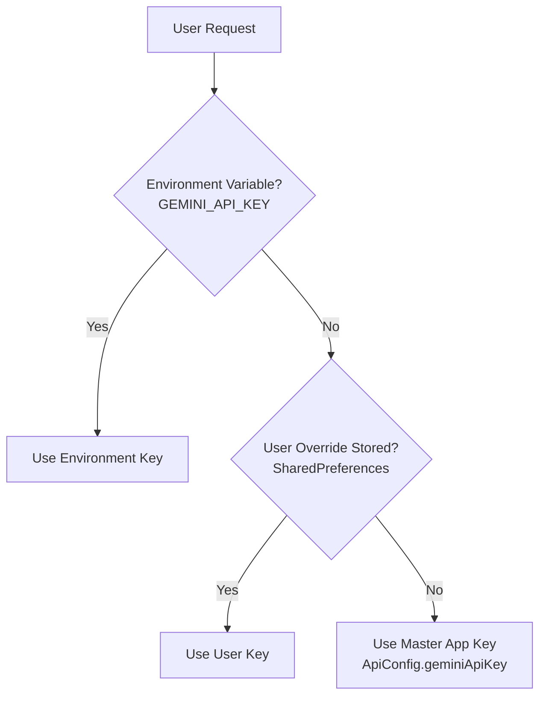

# FlockSense AI Advisor — Architecture & Integration Guide

## 1. Overview
FlockSense AI Advisor is an intelligent poultry diagnostic and consulting chatbot built on **Google Gemini 3.6 Flash**. It provides actionable recommendations for flock health, environmental control, feed management, mortality root-cause analysis, and growth benchmarking directly within the mobile application.

---

## 2. API Configuration Architecture
To deliver a frictionless user experience where end-users do not need to generate personal API keys, FlockSense uses a 3-tier key resolution hierarchy:

1. **Compile-time definition**: `--dart-define=GEMINI_API_KEY=...`
2. **User setting override**: Stored in `SharedPreferences` if the farm owner explicitly supplies their own key in the AI Settings dialog.
3. **Master Application Key**: Pre-configured in [`lib/config/api_config.dart`](file:///c:/MyProject/repo/FlockSense/lib/config/api_config.dart) ensuring 100% out-of-the-box availability for all users.

---

## 3. Active Google Model Endpoint
- **Model**: `gemini-3.6-flash`
- **Endpoint**: `https://generativelanguage.googleapis.com/v1beta/models/gemini-3.6-flash:generateContent`
- **Health Check**: `GeminiService.testApiKey()` tests connection latency and verifies HTTP 200 connectivity.

---

## 4. Real-Time Farm Context Injection
When a farmer asks a question, FlockSense automatically augments the prompt with:
- Active Farm and Shed identifiers
- Current bird count, age (days), and strain (Cobb 500 / Ross 308)
- Latest mortality rate and cull counts
- Recent Feed Intake (grams/bird) and estimated FCR
- Sensor telemetry: Temperature (°C), Relative Humidity (%), and Ammonia (ppm)

---

## 5. Visual Diagnostics Protocol
Users can upload poultry images from the camera or gallery. The application base64 encodes the image buffer with appropriate MIME types (`image/jpeg`, `image/png`) and sends it directly to Gemini for visual symptom analysis.
