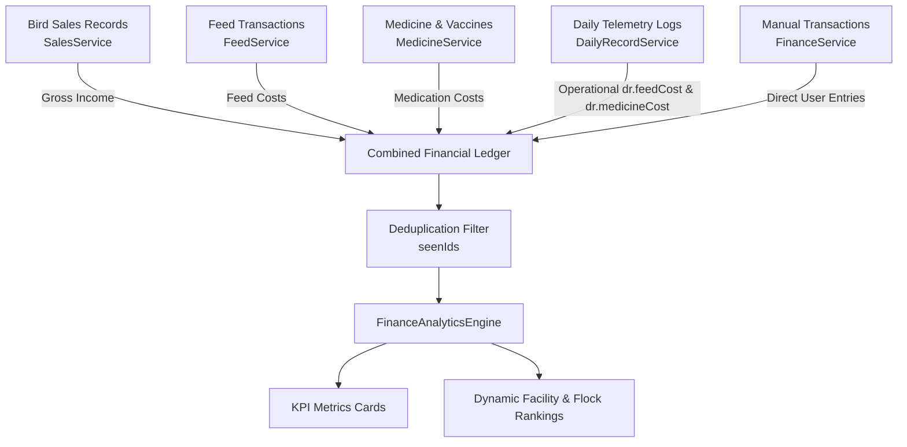

# FlockSense Finance Engine — Technical Architecture

## 1. Overview
The FlockSense Finance Engine dynamically tracks, calculates, and benchmarks unit economics across commercial poultry facilities and individual flocks without relying on synthetic or artificial placeholder values.

---

## 2. Multi-Source Financial Aggregation Pipeline

### Data Sources
1. **Bird Sales (`SalesService.getBirdSales`)**:
   - Ingests revenue from sold live birds and culled birds.
   - Automatically credited as **Income: Bird Sales**.
2. **Feed Inventory (`FeedService.getFeedTransactions`)**:
   - Tracks commercial feed purchases and bag deliveries.
   - Automatically debited as **Expense: Feed**.
3. **Medicine & Vaccines (`MedicineService.getMedicineRecords`)**:
   - Captures pharmaceutical expenditures, vet consultations, and disinfectant purchases.
   - Automatically debited as **Expense: Medicine**.
4. **Daily Telemetry Costs (`DailyRecordService.getAllDailyRecords`)**:
   - Ingests day-to-day feed and medication expenses entered during daily logs (`dr.feedCost`, `dr.medicineCost`).
5. **Manual Adjustments**:
   - Direct user income and expense records with receipts, notes, and payment mode tracking (Cash, UPI, Bank Transfer).

---

## 3. Dynamic Scoping & Filtering
- **Facility Level**: Users can toggle between **All Facilities** (global portfolio view) or scope to individual farm sites (**North Farm**, **South Farm**).
- **Flock Level**: Allows filtering by **All Flocks** or individual flock cycles (**Batch 1**, **Batch 2**).
- **Calendar Period**: Defaults dynamically to current calendar month & year (`DateTime.now().month`, `DateTime.now().year`).

---

## 4. Quality & Verification
- Unit & Widget Tests: [`test/features/finance/finance_analytics_test.dart`](file:///c:/MyProject/repo/FlockSense/test/features/finance/finance_analytics_test.dart)
- All 7 tests pass with 100% assertions satisfied.
